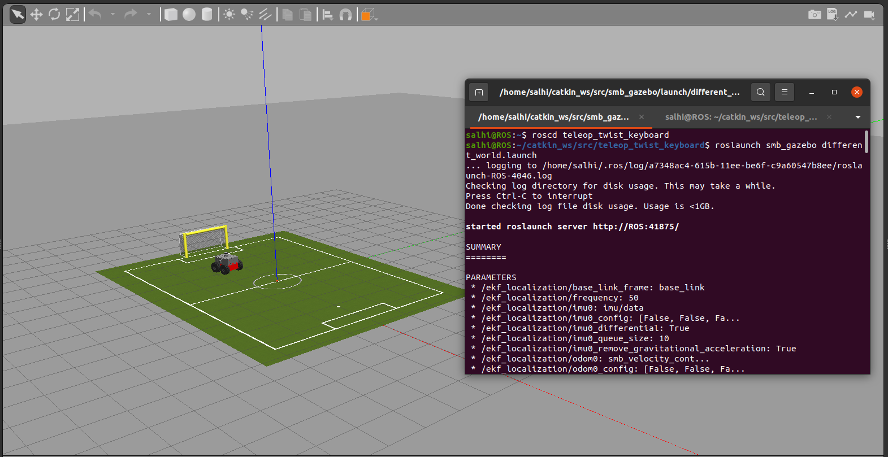

# Exercice 1 : 

#### Voici les notions que nous allons voir ensemble dans cet exercice : 

- ROS architecture
- ROS master, nodes, and topics
- Console commands
- Catkin workspace and build system
- Launch-files 


## 🛠️ Installations
       

#### 1 - Dans un premier temps il faut telecharger le fichier [smb_common.zip](https://github.com/Elmootez-Belleh/ROS-SMB/blob/main/smb_common.zip)
#### 2 - Se positionner dans le workspace : `cd ~/catkin_ws/src`
#### 3 - `unzip smb_common.zip`
#### 4 - `cd ..`
#### 5 - `catkin_make`
#### 6 - `source ~/catkin_ws/devel/setup.bash`


## 🧐 Simulation 

#### Nous allons lancer notre simulation avec roslaunch :


#### `roslaunch smb_gazebo smb_gazebo.launch` 

#### Ensuite, ouvrir un vouveau terminal et tapper les commandes suivantes : 

#### `rosnode list`

#### `rostopic list`

#### `rostopic echo clock`

#### `rostopic hz clock`
        
#### `rqt_graph`


##### Question 3 : Commandez une vitesse souhaitée au robot à partir du terminal (rostopic pub [TOPIC]).

##### `rostopic pub /cmd_vel geometry_msgs/Twist '[1.5,0,0]' '[0,0,1.0]'`
        
         
##### Question 4 : Utilisez teleop_twist_keyboard pour contrôler votre robot à l'aide du clavier. Trouvez-le en ligne et compilez-le à partir de la source ! Utilisez git clone pour cloner le dépôt.

###### `git clone https://github.com/ros-teleop/teleop_twist_keyboard.git`
###### `catkin_make`
###### `source ~/catkin_ws/devel/setup.bash`
###### `rosrun teleop_twist_keyboard teleop_twist_keyboard.py`


##### Question 5 : Launch file : 

```
<launch>
  <!-- Include another launch file or add more nodes here -->
  <include file="/home/salhi/catkin_ws/src/smb_gazebo/launch/smb_gazebo.launch">
    <!-- Change the world_file argument to a different world -->
    <arg name="world_file" value="/usr/share/gazebo-11/worlds/robocup14_spl_field.world"/>
  </include>

  <node pkg="teleop_twist_keyboard" type="/home/salhi/catkin_ws/src/teleop_twist_keyboard/teleop_twist_keyboard.py" name="Salhi_smb_teleop" output="screen"/>
</launch>
```

###### `catkin_make`
###### `source ~/catkin_ws/devel/setup.bash`
###### `roslaunch smb_gazebo different_world.launch`


----------

# Evaluation : 

#### 1 - Vérifiez si le package teleop_twist_keyboard est compilé à partir de la source (roscd teleop_twist_keyboard devrait afficher le dossier smb_ws).

###### `roscd teleop_twist_keyboard`

#### 2 - Lancer le launch file. Cela devrait mettre en place tout ce qui est nécessaire pour contrôler SMB avec le clavier 
###### `roslaunch smb_gazebo different_world.launch`

###### `rosrun teleop_twist_keyboard teleop_twist_keyboard.py`


----------


# Exercice 2 : 


#### Voici les notions que nous allons voir ensemble dans cet exercice : 

- ROS package structure
- Integration and programming with Eclipse
- ROS C++ client library (roscpp)
- ROS subscribers and publishers
- ROS parameter server
- RViz visualization

##### 1 - Téléchargez l'archive Zip contenant les fichiers préparés du package smb_highlevel_controller à partir d' [ici](smb_highlevel_controller.zip)

##### 2 -  Creer un  subscriber pour le topic `/scan`.
`ros::Subscriber subscriber = nodeHandle.subscribe('/scan', queue_size,callback);`
##### 3 - Callback method : 

```
void SmbHighlevelController::laserCallback(const sensor_msgs::LaserScan::ConstPtr& msg) {
    auto min_elem = std::min_element(msg->ranges.cbegin(), msg->ranges.cend());
    ROS_INFO_STREAM("La distance la plus proche est : " << *min_elem);
}
```

##### 4 - Launch file 

```
<launch>
  <arg name="world_name" default="/usr/share/gazebo-11/worlds/robocup14_spl_field.world"/>
  <arg name="laser_enabled" default="true"/>
  <arg name="kinect_enabled" default="false"/>

  <include file="$(find smb_gazebo)/launch/smb_gazebo_empty.launch">
    <arg name="world_name" value="$(arg world_name)"/>
    <arg name="laser_enabled" value="$(arg laser_enabled)"/>
    <arg name="kinect_enabled" value="$(arg kinect_enabled)"/>
  </include>

  <node name="teleop_key" pkg="teleop_twist_keyboard" 
    type="teleop_twist_keyboard.py" />

  <node name="smb_hl_ctrl" pkg="smb_highlevel_controller"
    type="smb_highlevel_controller_node" output="screen" >
    <rosparam  command="load"
      file="$(find smb_highlevel_controller)/config/default.yaml" />
  </node>

  <node name="rviz" pkg="rviz" type="rviz" args="-d $(find smb_highlevel_controller)/rviz/smb_laser.rviz" output="screen" />

</launch>
```

 ##### 4 - RViz 

`roslaunch smb_highlevel_controller smb.launch `
 


##### 5 - RViz, robocup14_spl_field.world 

`roslaunch smb_highlevel_controller smb_controller.launch`


##### 6 -  smb_highlevel_controller node

